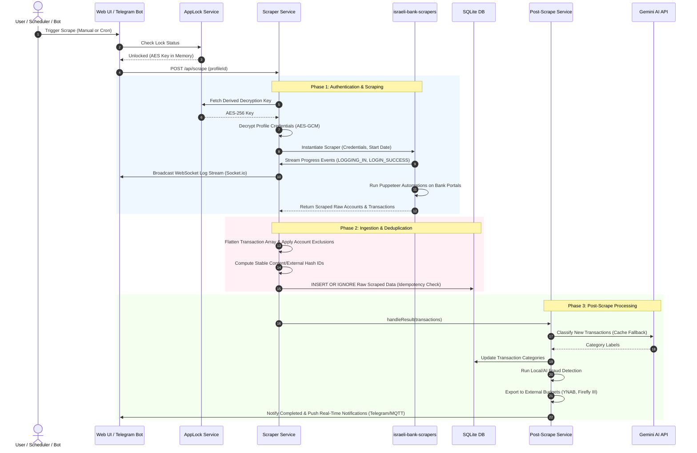
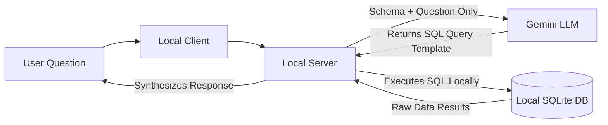

# Mabat Kalkli (Financial Overview) — System Design & Architecture
*Designed as a Senior/Staff Software Engineer Interview "Architecture Story"*

---

## Executive Summary & Architecture Philosophy

**Mabat Kalkli (Financial Overview)** is a modern, self-hosted financial intelligence system designed to scrape, aggregate, categorize, and analyze transaction data from Israeli banking and credit card portals. 

Unlike traditional SaaS financial aggregators (e.g., Mint, YNAB) that process credentials in the cloud, Mabat Kalkli is architected around a **Privacy-First, Self-Hosted Philosophy**. The system runs locally via **Docker** (or as a native **Electron desktop shell** for Windows), ensuring that highly sensitive bank credentials and financial history never leave the user’s home network.

### Why Self-Hosted via Docker/Local Electron?

1. **The Trust & Privacy Trade-off**: Banking credentials (usernames, passwords, identity numbers) represent the keys to a user's financial kingdom. Forcing a user to entrust these credentials to a third-party SaaS cloud creates a massive security footprint and high liability.
2. **IP Reputation & Anti-Bot Mitigations**: Israeli financial portals employ aggressive bot-detection and geofencing systems. Cloud IP ranges (AWS, GCP, DigitalOcean) are heavily blacklisted. Running the scraping workers on the user’s home machine leverages their **residential IP address**, bypassing typical cloud geoblocking and bot countermeasures.
3. **Complete Data Sovereignty**: All transaction history is persisted in a local database, protected by OS-level file permissions rather than cloud database security systems.

---

## High-Level System Architecture & Component Decomposition

The system is organized as a decoupled, multi-tiered monorepo consisting of a React client, an Express.js API server, and a Node-based worker runtime orchestrating browser-based scraping.

```mermaid
graph TD
    subgraph Client Layer (Desktop/Web)
        UI[React / Vite SPA]
        Electron[Electron Wrapper / Tray App]
        UI -->|Proxies / REST API| Server
        UI <-->|WebSockets Progress Stream| SocketIO
    end

    subgraph Backend Core (Node.js/Express)
        Server[Express App / Router]
        SocketIO[Socket.io Engine]
        Scheduler[Scheduler Service]
        ScraperSvc[Scraper Service]
        PostScrape[Post-Scrape Service]
        AppLock[App Lock Service]
        AISvc[AI & Persona Service]
        DB[Database Service]
        
        Server --> ScraperSvc
        Server --> AppLock
        Server --> DB
        ScraperSvc --> PostScrape
        PostScrape --> AISvc
        PostScrape --> DB
        Scheduler --> ScraperSvc
    end

    subgraph Worker & Scraping Layer
        Browser[Puppeteer / Headless Chromium]
        Lib[israeli-bank-scrapers Library]
        ScraperSvc -->|Orchestrates| Lib
        Lib -->|Runs Automations| Browser
    end

    subgraph Data Store & External Services
        SQLite[(SQLite DB app.db WAL Mode)]
        ConfigFiles[On-Disk JSON Files / Profiles]
        Gemini[Google Gemini API]
        Telegram[Telegram Bot API]
        MQTT[Home Assistant / MQTT Broker]
        
        DB --> SQLite
        AppLock --> ConfigFiles
        AISvc --> Gemini
        PostScrape --> Telegram
        PostScrape --> MQTT
    end
    
    Browser -.->|HTTPS / Scraping| Bank[Israeli Banks & Cards]
```

### Component Breakdown

#### 1. Client Layer (React / Electron)
* **React Web UI**: Built with Vite, React, and TypeScript. Acts as a single-page application (SPA) displaying dashboards, logs, system configurations, and triggering manual scraping actions.
* **Electron Desktop Shell**: Wraps the React client and the Express backend into a single Windows installer (`.exe`). It runs a background **system tray indicator** to keep the API server and scheduler running even when the UI window is closed, enabling background cron-like tasks.

#### 2. Backend Service Layer (Node.js & Express)
* **Express.js API**: Handles routes under `/api/*` (e.g., config, profiles, scraping logs, and analytics).
* **Socket.io WebSocket Server**: Establishes a real-time channel to stream scraper logs and browser progress directly to the user interface.
* **App Lock Service**: Controls session locking and decryption key derivation.
* **Post-Scrape Ingestion Service**: Orchestrates downstream workflows (AI categorization, fraud detection, budget exports, and notifications).

#### 3. Worker & Scraper Layer (Puppeteer & Chromium)
* Wraps the community-driven `israeli-bank-scrapers` library.
* Dynamically locates local installations of **Google Chrome** or **Microsoft Edge** on Windows to avoid bundling heavy browser binaries, reducing installer sizes.
* Executes headless Puppeteer instances to log in to bank portals, retrieve PDF/HTML statements, and parse transactional tables.

#### 4. Storage & Integrations Layer
* **SQLite (with WAL Mode)**: Stores the transaction ledger, AI analyst memories, investments, and rule configs.
* **File System (JSON blobs)**: Stores encrypted scraper configuration profiles.
* **Integrations**: Connects to **Telegram** (updates and command interactions), **Home Assistant/MQTT** (smart home integrations), **Google Drive/Sheets** (cloud backups and sync), and **Gemini API** (financial AI analysis).

---

## Detailed Data Flow & Ingestion Lifecycle

The ingestion process is designed to be highly resilient, real-time, and idempotent. Below is the end-to-end data lifecycle when a scrape operation is triggered:



### In-Depth Lifecycle Steps

1. **Triggering**: Ingestion begins via a user action in the UI, an MQTT command from Home Assistant, a Telegram message, or the Express-based scheduler cron runner.
2. **Lock Validation**: Scrapes require access to bank credentials. The `ScraperService` checks if the application is unlocked. If locked, the execution is blocked immediately to protect the credentials.
3. **Decryption at Runtime**: The service retrieves the password-derived AES key from memory, decrypts the credentials blob in-memory, and immediately sanitizes the variable. Credentials are never written to temporary files or logs.
4. **Browser Orchestration**: Puppeteer fires up Chromium. It navigates to the financial portals, handles multi-factor auth (like One Zero OTP SMS tokens), and extracts transaction records.
5. **Real-time Progress Streaming**: WebSocket events (Socket.io) push exact step definitions (e.g., `START_SCRAPING`, `LOGGING_IN`, `LOGIN_SUCCESS`) to the frontend, preventing the user from feeling left in the dark during slow scraping operations.
6. **Data Deduplication (Idempotency Engine)**: 
   To prevent duplicating transactions across overlaps, Mabat Kalkli implements a **Precedence-Based Idempotency Engine** in `shared/src/transactionId.ts`:
   * **Rule 1: Scraper/Bank ID preservation**: If the bank provides a stable, unique reference ID (e.g., reference numbers), it is preserved.
   * **Rule 2: External Hashing**: If a stable transaction identifier is available but needs structure, the system builds an external key: 
     $$\text{key} = \text{"v1|ext|" + provider + "|" + accountNumber + "|" + externalId}$$
     and hashes it using MD5.
   * **Rule 3: Content-Based Hashing**: If no external ID exists, it hashes the core transaction properties:
     $$\text{key} = \text{date} \mathbin{\Vert} \text{amount} \mathbin{\Vert} \text{description} \mathbin{\Vert} \text{accountNumber}$$
     To handle legitimate duplicate charges (e.g., two identical coffees bought at the same merchant on the same day), the ingestion engine keeps an ordinal map of the batch. The first transaction receives `MD5(key)`, the second receives `MD5(key + "|1")`, and so on.
   * **Database Insertion**: The generated ID serves as the Primary Key in SQLite. Using `INSERT OR IGNORE`, duplicate transactions are discarded on-write, making ingestion completely idempotent.
7. **Post-Scrape Pipeline**: After saving raw data, the pipeline executes:
   * **AI Categorization**: Runs Gemini AI to label transaction categories. It writes matching descriptions to a `categories_cache` database table to minimize future API costs.
   * **Transaction Review Alert**: Identifies transfers or uncategorized transactions, alerting the user to add details. Telegram prompts are sent, allowing users to type a reply directly in the chat to add memos or correct categories.
   * **Fraud Analysis**: Runs heuristics and Gemini to flag anomalous charges.
   * **Budget Syncing**: Syncs data to platforms like YNAB, Google Sheets, or Firefly III.

---

## Security & Privacy Engineering (Security by Design)

Mabat Kalkli operates in a highly sensitive domain. It implements rigorous cryptographic controls and architectural separation of concerns.

### 1. Credentials-at-Rest Encryption (AES-256-GCM)

Credentials stored inside `data/profiles/*.json` are fully encrypted.

* **Key Derivation Function (KDF)**: The application utilizes **scrypt** (`scryptSync`) to derive a 256-bit key from the user’s App Lock password.
* **Cryptographic Strength**: Parameters are tuned to resist brute-force attacks:
  ```typescript
  const SCRYPT_PARAMS = {
      scryptN: 16384, // CPU/memory cost parameter
      scryptR: 8,     // Block size parameter
      scryptP: 1,     // Parallelization parameter
      keylen: 64      // Derived key length
  };
  ```
* **Encryption Algorithm**: **AES-256-GCM** (Galois/Counter Mode). GCM provides Authenticated Encryption with Associated Data (AEAD), ensuring both confidentiality and cryptographic integrity.
* **Format on Disk**: Stored in a string serialization format: `ivHex:authTagHex:ciphertextHex`. Decryption verifies the `authTagHex` before processing data, protecting against bit-flipping attacks.
* **Zero-Retention Memory Lifecycle**: When the user locks the application, the app lock service clears the derived key buffer in memory:
  ```typescript
  this.profileEncryptionKey.fill(0); // Overwrites memory bytes with zeros
  this.profileEncryptionKey = null; // Dereferences for garbage collection
  ```
  This mitigates memory-dump attacks (heartbleed-type exploits or process dumps).

### 2. Local AI Data Privacy (Super Privacy Analyst Mode)

Standard LLM chatbot integrations send complete transaction history datasets to the cloud (e.g., Google or OpenAI servers) to answer queries. 

To solve this privacy exposure, Mabat Kalkli features a **Super Privacy Analyst Mode**:



1. Instead of sending transaction logs to the cloud, the local backend sends only the database schema definition and the user's plain-text question to Gemini.
2. Gemini behaves as a code generator, outputting a safe, read-only SQL query (e.g., `SELECT SUM(amount) FROM transactions WHERE date LIKE '2026-05%'`).
3. The local Express server executes the SQL query against the local SQLite database.
4. The output values are merged locally into a final natural language response.
5. **Result**: The LLM model never sees a single transaction record, keeping transaction history offline.

---

## Resiliency & Reliability Engineering

Scraping banking portals is notoriously flaky. Institutions modify frontends without notice, network connections drop, and sessions expire. Mabat Kalkli uses several resiliency strategies:

### 1. Robust Puppeteer Orchestration
* **Execution Path Detection**: Automatically fallbacks from standard Puppeteer paths to system Chrome or Microsoft Edge binaries to guarantee compatibility across diverse developer/production OS states.
* **Sandboxing Configurations**: Combines `--no-sandbox` and `--disable-setuid-sandbox` flags dynamically to ensure Puppeteer runs reliably inside isolated Docker containers without host privilege escalation.

### 2. Two-Factor Authentication (2FA) State Storage
* **One Zero OTP Session Cache**: For institutions requiring SMS OTP tokens, the system does not fail the scrape. It initiates an asynchronous OTP session via `oneZeroOtpTrigger`, caches the active Puppeteer/browser instance in memory via a custom session token (`oneZeroOtpSessionStore`), prompts the user for the code in the UI or Telegram, and resumes the automation flow upon code entry.

### 3. Database Integrity & Concurrency
* **WAL (Write-Ahead Logging) Mode**: Enabled via SQLite (`db.pragma('journal_mode = WAL')`). This provides excellent concurrency, allowing concurrent read connections while a background scraping process performs bulk transaction updates.
* **Transaction Safe Seeding**: All database migration routines and startup operations utilize SQLite transactions to ensure that interruptions (like Docker container restarts) never leave the database file in a corrupted, half-migrated state.

---

## Technical Trade-offs

| Architectural Decision | Pros | Cons |
| :--- | :--- | :--- |
| **Self-Hosted (Local Docker/Electron) vs. Centralized Cloud SaaS** | <ul><li>Zero exposure of banking credentials to third-party clouds.</li><li>No recurring subscription fees for SaaS infrastructure.</li><li>Natural bypass of geoblocking & cloud blacklists using residential IPs.</li></ul> | <ul><li>User is responsible for system updates and uptime.</li><li>Harder to access from outside the home network without configuring reverse proxies/VPNs (Tailscale).</li><li>Stolen physical disks can expose transactions if full-disk encryption isn't enabled.</li></ul> |
| **SQLite vs. Traditional RDBMS (PostgreSQL/MySQL)** | <ul><li>Zero configuration; database is a single file (`app.db`).</li><li>Extremely fast read speeds; no network overhead.</li><li>Ideal for single-user desktop deployments.</li></ul> | <ul><li>Not suited for multi-user, distributed scale.</li><li>Database locks can occur under write contention (partially mitigated by WAL mode).</li></ul> |
| **Puppeteer Scraping vs. Official Open Banking APIs** | <ul><li>Provides comprehensive access to all accounts and credit cards.</li><li>Does not require expensive corporate licenses or official bank developer partnerships.</li></ul> | <ul><li>Fragile; susceptible to bank UI changes.</li><li>No standardized API response format; requires continuous maintenance of parser rules.</li></ul> |

---

## Clean Code & System Decoupling Patterns

1. **Decoupled Monorepo Structure**: 
   * `/shared`: Holds mathematical algorithms, data models, validation schemas, and types. Shared between the React frontend and Node backend to guarantee single-source-of-truth types.
   * `/server`: Focuses on Express APIs, service patterns, and database operations.
   * `/client`: Handles state management, UI layouts, and WebSocket client connections.
2. **Dependency Injection**: Services like `SchedulerService` accept dependencies (such as `ScraperService` and `ProfileService`) via constructor injection. This makes unit testing straightforward and ensures clean separation of concerns.
3. **Event-Driven notifications**: Scraper results broadcast updates asynchronously to Telegram Bots and Home Assistant MQTT brokers, decoupling the scraper core from the delivery channels.
